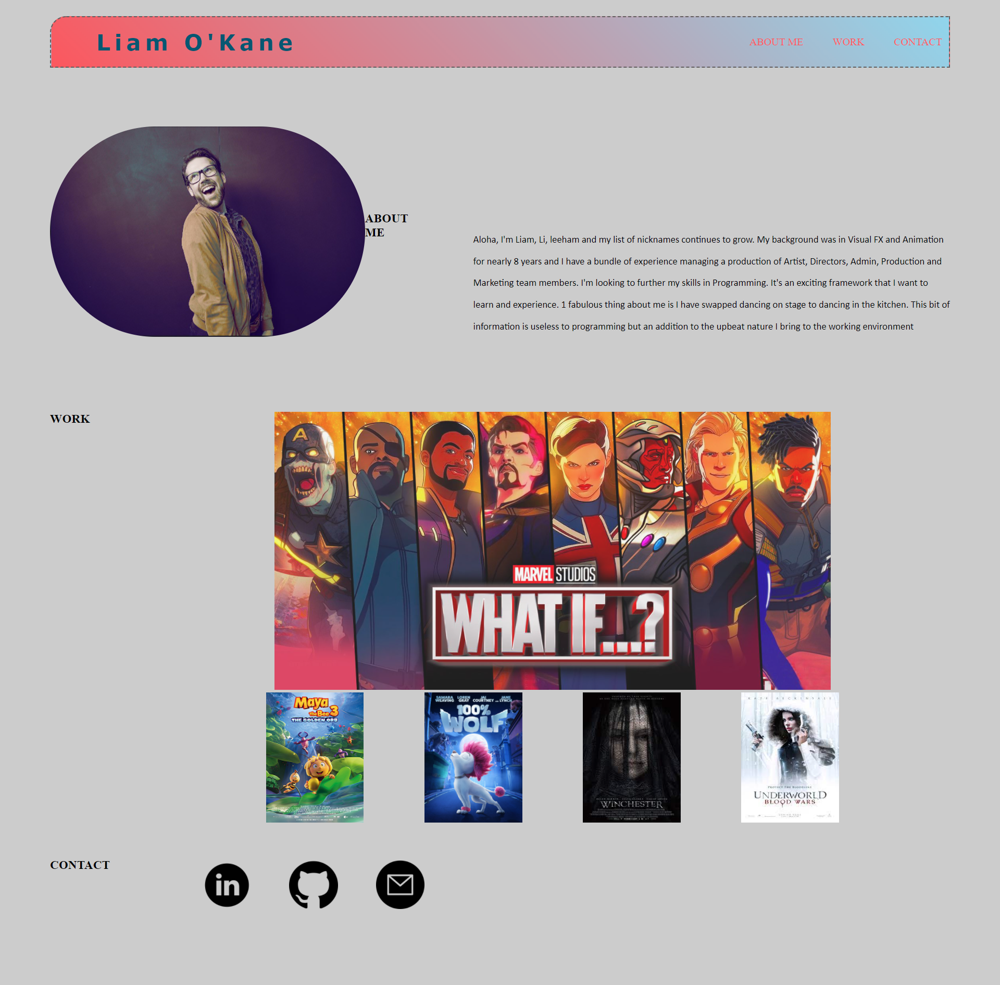

# liamo_portfolio

## Description
- The objective was to create a portfolio website using Github pages as a bridge. The web page must be web accesible and have a visual treatment review. 
- A wireframe process will need to be created before implementation
- It was important that this review included a web accesibility and easy access for inclusive purposes. 
- The web page must:
- - Look good on a mobile device as well as desktop
- - Should have a navigation at the top.  When clicking these links it should take you to the relevant section on the page
- - Should have information about me (a bio)
- - Should have one main project link that is bigger than the others
- The biggest hurdle was the mobile responsiveness but once applying the appropriate media query in my CSS file it adapted the page accordingly. 

## Table of Contents
- [Strategy](#strategy)
- [Assets](#assets)
- [Links](#links)
- [Credits](#credits)
- [License](#license)
  

## Strategy - Phase1

1. Review the objective of the assignment and plan Computational Thinking. Decomposition, Pattern recognition, Abstraction and Algorithim. 
2. Build a wireframe (image reference below)
3. Create a repository first via github. Whilst including the new repo make sure that it's set to 'Public' and that you have the READme file attached. 
4. Git clone to your local server. 
5. Open both the HTML and CSS make sure that the CSS is linking up with the HTML. 
6. Refrencing the wireframe created, begin to build the box/es planned for this assignment. 
7. Go back to the goals that you have listed in Step 1 and work through them. 
8. Throughout the process continue to git commit messages of your updates and push to github. While you're pushing to github make sure your pushing the local folder so your work also versions up to github. 
9. Once your web page is looking like the objective set by the instructors deploy Github Link. 

## Strategy - Phase 2
| Task       | Progress      | 
| ------------- |:-------------:| 
| Update Portfolio |:Strategy:| 
|  Display your contact information.  | Inprogress |  
| Have links to your GitHub profile and LinkedIn profile | Complete |
| Have a link to a downloadable PDF of your resume | Complete |
| Display at least 2 examples of student work from either deployed projects or homeworks. | Not Yet started |
| Projects display must have  Project title, Link to the deployed version, Link to the GitHub repository, Screenshot of the deployed application | Not Yet Started |  
| Design |:Strategy:| 
| Have a polished, mobile-responsive user interface. | Not Yet Started | 
| Choose a color palette, apply Bootstrap if you can. (Make sure the font size is large enough to read, and that the colors don't cause eye strain.) | Not Yet Started | 
| Github |:Strategy:| 
| Updated Github details, profile pic, bio, email address, Link to depolyed portfolio, 2 pinned repos, follower developers | In Progress | 
| Pinned repos to have Title of app, Live link to deployed app, List of technologies used, 1-2 sentences explaining what the app is, 2-3 Screenshots / gifs of the app, License (usually MIT), Contact information for you and any collaborators, commit history | In progress | 

## Assets
The following image is a representation of the wireframe I worked towards for this assignment: 

The following image demonstrates the web application's default appearance and functionality: 

## Links
- Github link for reference is below: 
https://github.com/liamok19/liamo_portfolio.git

- Website Link for reference is below: 
https://liamok19.github.io/liamo_portfolio/

## Credits

Based on the research I found the following sources that I would like to credit for this project: 
| Source        | Platform      | Other  |
| ------------- |:-------------:| -----:|
| MONUiXD    | Youtube      |Title: Basic Wireframing - HTML & CSS | 
| #ask your classmaters | Slack      |Conversations between instructors and classmates |
| MDN Web Docs   | MDN Web Docs       | Title: linear-gradient() |
| Markdown Guide | Markdown Guide |Title: https://www.markdownguide.org/cheat-sheet/ |
| dcode    | Youtube      |Title: Easily Add Social Media Icon Links to Your Website with HTML & CSS| 
| freeCodeCamp.org    | Youtube      |Title: Build and deploy a portfolio website [Full Tutorial Course]| 
| Lisa Friedrichsen    | Youtube      |Title: Using html 5 wireframe tags| 

### Updating Portfolio

## Strategy 
| Task       | Progress      | 
| ------------- |:-------------:| 
|   | In Progress | 

## License
- Existing projects and communities, this README file is publicly open for reference and review. 

## Pat yourself on the back once you have got to this point	😀